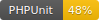

[]() [](https://www.php-fig.org/psr/psr-12/) [](https://brianhenryie.github.io/bh-php-monero-explorer/) [](https://phpstan.org/)

# Monero Explorer PHP Client


A thin, strongly typed PHP SDK for [Onion Monero Blockchain Explorer](https://github.com/moneroexamples/onion-monero-blockchain-explorer/) instances' HTTP API, e.g. [xmrchain.net](https://xmrchain.net/).  

> [Monero](https://www.getmonero.org/) (XMR) is a private, decentralized cryptocurrency, developed with the goals of privacy and security first, ease of use and efficiency second. 

Fetching and parsing JSON is very easy with PHP, so this library's value comes from the typed classes and the documentation in PhpDoc. Please contribute clarifications to functions' purposes.

## Use

Before v1.0, function signatures are expected to change as they are properly documented.

```bash
composer require --fixed brianhenryie/bh-php-monero-explorer@dev
```

You also need a [PSR-7 implementation](https://packagist.org/providers/psr/http-client-implementation) and a [PSR-17 implementation](https://packagist.org/providers/psr/http-factory-implementation), the most popular being `guzzlehttp/guzzle`. 

`ExplorerApi` is a direct mapping of [API endpoints](https://github.com/moneroexamples/onion-monero-blockchain-explorer/blob/aa96ce2927c050fabe17154a3bdfb09be83a632f/main.cpp#L656-L837) to PHP functions.

```php
/** @var Psr\Http\Message\RequestFactoryInterface $requestFactory */
$requestFactory = new \GuzzleHttp\Psr7\HttpFactory();
/** @var Psr\Http\Client\ClientInterface $client */
$client = new \GuzzleHttp\Client();

$explorerApi = new \BrianHenryIE\MoneroExplorer\ExplorerApi( $requestFactory, $client );

/** @var \BrianHenryIE\MoneroExplorer\Model\NetworkInfo $networkInfo */
$networkInfo = $explorerApi->getNetworkInfo()

$lastBlockHeight = $networkInfo->getHeight() - 1;
```

`ExplorerTools` extends `ExplorerApi` to add convenience functions.

```php
$explorerTools = new \BrianHenryIE\MoneroExplorer\ExplorerTools( $requestFactory, $client );

$lastBlockHeight = $explorer->getLastBlockHeight();
```

### Accept a Monero payment

To accept a payment with Monero...

1. Share payment address with customer
1. Note the blockchain height at that time
1. Periodically/progressively check new blocks since then inspecting for payment

See: [`examples/VerifyingPaymentsReceived.php`](https://github.com/BrianHenryIE/bh-php-monero-explorer/blob/master/examples/VerifyingPaymentsReceived.php).

## Implementation

Initial `class-monero-explorer-tools.php` extracted from [monero-integrations/monerowp](https://github.com/monero-integrations/monerowp/blob/9ba2b640f7bd31441f9994dd66916bf480ed9016/include/class-monero-explorer-tools.php).

### Goals:

* [ ] Strongly typed: some types are incomplete, some are deserialized as arrays
* [ ] Unit tested: 100% should be achievable on what is just a thin wrapper
* [x] Use [PSR-7 HTTP client](https://www.php-fig.org/psr/psr-7/) | [PSR-17 HTTP factory](https://www.php-fig.org/psr/psr-17/)
* [ ] PhpDoc
* [x] Short tutorial

### Notes

* API is read-only
* API responses are JSON formatted using the [JSend](https://github.com/omniti-labs/jsend) convention

### Composer

The required libraries were chosen due to their robust code coverage:

* [miWebb/JSend](https://github.com/miWebb/JSend) - 100% coverage
* [JsonMapper/JsonMapper](https://github.com/JsonMapper/JsonMapper) | [JsonMapper.net](https://jsonmapper.net) - 100% coverage


## Acknowledgements

* [Monero Onion Blockchain Explorer](https://github.com/moneroexamples/onion-monero-blockchain-explorer/graphs/contributors)
* [SerHack](https://github.com/serhack)
